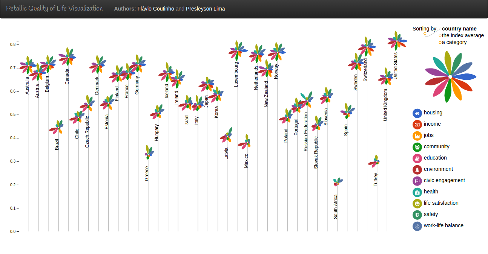
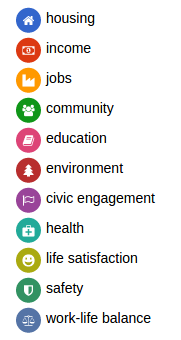
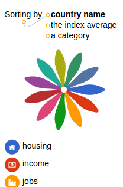
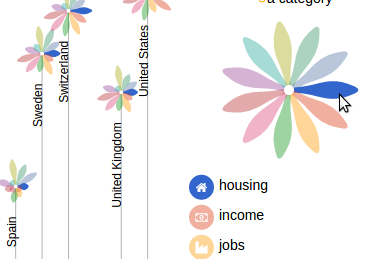

# Relatório do TP2

Este relatório descreve as atividades realizadas para o desenvolvimento
de uma visualização em pétalas com funcionalidades dinâmicas como ordenação
e destacamento. A visualização está disponível em
https://fegemo.github.io/dataviz-tp2/ e seu código fonte está hospedado
em https://github.com/fegemo/dataviz-tp2/.

Autores do trabalho:

1. Flávio Roberto dos Santos Coutinho (pós graduação)
1. Presleyson Lima (pós graduação)

## Implentação das Funcionalidades

Foram implementadas as funcionalidades de:

- **Legenda**: há uma **legenda à direita da visualização**, mostrando,
  com ícone, nome e cor, cada categoria de subíndice dos dados.

  
- **Ordenação**: há controles de ordenação no canto superior direito
  (vide imagem) que, quando clicados, alteram a **ordenação das flores**. As
  opções são: (a) ordenar **por nome do país**, (b) **pela média do
  índice** ou (c) **pelo valor de um subíndice**. Neste último caso, deve-se
  clicar em uma pétala para se escolher por qual subíndice as flores
  devem ser ordenadas. Clicando-se sucessivamente na mesma ordenação,
  ela é alterada de crescente para decrescente.

  
  - _Extra_: a ordenação é feita nos dados, mas também nos elementos HTML de
    forma que, visualmente, **o usuário vê com uma transição, para onde cada
    país vai**.
  - _Extra_: além dessa dica visual, **é possível clicar no nome de cada país**,
    deixando-o **visualmente destacado** (de amarelo e com uma setinha),
    auxiliando o usuário a não perder de vista o(s) paíse(s) de
    interesse quando de uma ordenação.
- **Destacamento** (_highlighting_): ao pousar o mouse sobre uma pétala,
  todas as pétalas, e a legenda, que representam aquela categoria de subíndice
  **são destacadas em relação às outras**, que ficam menos opacas.

  
- **Animação de entrada**: as **flores sobem e desabrocham uma a uma** quando
  a visualização é aberta pela primeira vez.
- **Pétalas com formas**: em vez de desenhar pétalas como linhas retas, elas
  foram desenhadas como _paths_ com uma cor de preenchimento.
  - _Extra_: é possível usar outros formatos de pétalas colocando `?petal=FORMATO` na URL. Os formatos disponíveis são [`daisy`][daisy] (o padrão), [`ornitop`][ornitop] e
  [`cylindric`][cylindric].

[daisy]: https://github.com/fegemo/dataviz-tp2/?petal=daisy
[ornitop]: https://github.com/fegemo/dataviz-tp2/?petal=ornitop
[cylindric]: https://github.com/fegemo/dataviz-tp2/?petal=cylindric

## Decisões Tomadas

A tabela foi desenvolvida usando recursos da versão ES2015 da linguagem
JavaScript (_e.g._, _arrow functions_, classes) e também de recursos nível
4 do CSS (_e.g._, variáveis, _nesting_, função de cores).

Há três classes: `Country`, `Petal` e `PetalVisualization`. A primeira contém a informação de cada país, com o nome e seus índices. A segunda contém as informações visuais sobre cada pétala. A terceira contém a maior parte do código e gere a criação e atualização de toda a visualização.
